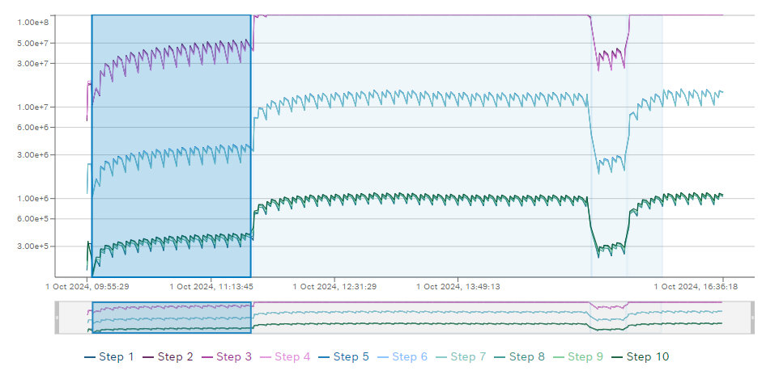
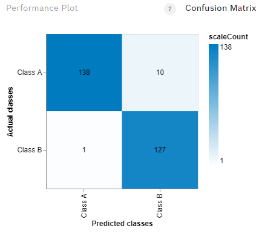
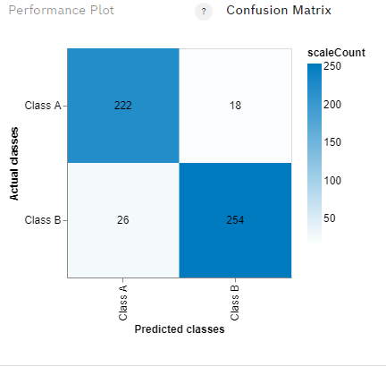

# PetWellTech 

PetWellTech develops hardware and software for monitoring pet health and associated activities.

The goal of the pilot project is to investigate possibilities of monitoring VOCs in dog breath with hardware available on the market and build a prototype solution 
that can detect for example acetone in dog breath. 

# Sensors investigated 
|  | "Electronic nose", Bosch BME688 sensor | A [development kit](https://www.sparkfun.com/products/19630) consisting of 8 individual BME688 sensors was used to collect data along with a [Thing Plus - ESP32 WROOM (Micro-B)](https://www.sparkfun.com/products/15663) |
| --------------------------------------------------------------- | -------------------------------------- | ----------------------------------------------------------------------------------------------------------------------------------------------------------------------------------------------- |

Documentation for the BME688 sensor can be found [here](https://www.bosch-sensortec.com/software/bme/docs/overview/getting-started.html).

## Collecting data from the BME688 sensor 

### Test 1 
Controlled environment in a plastic box. 
Volume of the box is 0,013 cubic meters. The amount of acetone injected was 0.01 ml 
The concentration of acetone was 0.769 ppm

Since 1 m\(^3\) of acetone in 1 m\(^3\) of air would be 1,000,000 ppm (by volume), we can convert the concentration to ppm:

Concentration (ppm) = 7.69 × 10^-7 × 1,000,000 ≈ 0.769 ppm

The acetone was added to the enclosed box using a small syringe at the beginning of the test. There was no more acetone added during the test.

 
  

The table below shows the data collected for the different acetone concentrations and for clean air, as well as the duration of the data collection.

|               | \*Temperature (°C) | \*Humidity (%) | \*Pressure (hPa) | \*Gas Resistance (Ω) | Duration (mins) |
| ------------- | ------------------ | -------------- | ---------------- | --------------------- | ---------------- |
| Air training  |     3.501277e+01   | 1.925969e+01   | 1.020081e+03     | 3.489649e+07          | 45      |
|  Air test     |     3.459404e+01   | 1.943559e+01   | 1.018670e+03     | 3.361244e+07          | 45      |
|Acetone training| 3.635105e+01       | 2.050594e+01   | 1.021596e+03     | 1.580791e+07          | 15       |
| Acetone test  | 3.543839e+01       | 1.962744e+01   |  1.018924e+03    | 1.418220e+07          | 15 |

#### Formatted data (observe gas resistance in Mega ohms) 

|                 | Temperature (°C) | Humidity (%) | Pressure (hPa) | Gas Resistance (MΩ) | Duration (mins) |
| --------------- | ---------------- | ------------ | -------------- | ------------------- | ---------------- |
| Air training    |        35.01     |      19.26   |     1020.08    |         34.90       |       45        |
| Air test        |        34.59     |      19.44   |     1018.67    |         33.61       |       45        |
| Acetone training|        36.35     |      20.51   |     1021.60    |         15.81       |       15        |
| Acetone test    |        35.44     |      19.63   |     1018.92    |         14.18       |       15        |

The image below shows the resistance change over time when the sensor was exposed to acetone and air. The highlighted area shows the resistance change when the sensor was exposed to acetone for the first cycle. WWhen the sensor was exposed to air the resistance decreased notably. The average resistance here was X

Compared to the reference air, the resistance change for acetone was significant. This is a good indication that the sensor can be trained to detect it at least at relatively high concentration.

#### AI training

Using the BME studio software an algorithm was trained to detect acetone. The training data set was used to train the data with a 70/30 split. 
The image below shows the confusion matrix for the training data set.

The table below shows the accuracy of the training data set.

| Accuracy | F1 score | False positive |
| -------- | -------- | -------------- |
| 96.01%   | 96.11%   | 4.01%          |

#### AI testing
USing the BME studio software the trained algorithm was tested with the test data set. The image below shows the confusion matrix for the test data set.

This show that the algorithm was able to detect acetone with a high accuracy.

| Accuracy | F1 score | False positive |
| -------- | -------- | -------------- |
| 91.54%   | 91.53%   | 8.55%          |

## Test 2

# Relevant publications 

1. Z. Wang, C. Wang and P. Lathan, Breath Acetone Analysis of Diabetic Dogs Using a Cavity Ringdown Breath Analyzer, in IEEE Sensors Journal, [doi: 10.1109/JSEN.2013.2293705](https://ieeexplore.ieee.org/document/6678180).
2. Saasa V, Malwela T, Beukes M, Mokgotho M, Liu CP, Mwakikunga B. Sensing Technologies for Detection of Acetone in Human Breath for Diabetes Diagnosis and Monitoring. Diagnostics (Basel). 2018 Jan 31;8(1):12. [doi: 10.3390/diagnostics8010012](https://www.ncbi.nlm.nih.gov/pmc/articles/PMC5871995/).  
 
