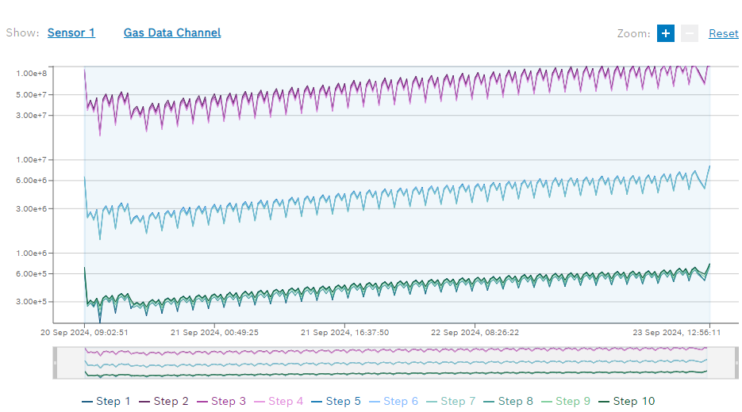

# PetWellTech 

PetWellTech develops hardware and software for monitoring pet health and associated activities.

The goal of the pilot project is to investigate possibilities of monitoring VOCs in dog breath with hardware available on the market and build a prototype solution 
that can detect for example acetone in dog breath. 

# Sensors investigated 
|  | "Electronic nose", Bosch BME688 sensor | A [development kit](https://www.sparkfun.com/products/19630) consisting of 8 individual BME688 sensors was used to collect data along with a [Thing Plus - ESP32 WROOM (Micro-B)](https://www.sparkfun.com/products/15663) |
| --------------------------------------------------------------- | -------------------------------------- | ----------------------------------------------------------------------------------------------------------------------------------------------------------------------------------------------- |

Documentation for the BME688 sensor can be found [here](https://www.bosch-sensortec.com/software/bme/docs/overview/getting-started.html).

## Collecting data from the BME688 sensor 

### Test 1 
Controlled environment in a plastic box. 
[Image of the setup]
The table below shows the data collected for the different acetone concentrations and for clean air, as well as the duration of the data collection.

|               | \*Temperature (°C) | \*Humidity (%) | \*Pressure (hPa) | \*Gas Resistance (kΩ) | Duration (hours) |
| ------------- | ------------------ | -------------- | ---------------- | --------------------- | ---------------- |
| Reference air |     ?       |     ?    | 1015.12          | ?              | 72h 0m 0s        |
| Acetone 0.1ml  x 2 (with an interval of 2h)          | ?            | ?         | ?          | ?                 | 72h 0m 0s        |

The image below shows the resistance change over time when the sensor was exposed to clean air. The average resistance here was X 

Whereas the image below shows the resistance change over time when the sensor was exposed to acetone. The average resistance here was X

Compared to the reference air, the resistance change for acetone was significant. This is a good indication that the sensor can be trained to detect it at least at relatively high concentration.

# Relevant publications 

1. Z. Wang, C. Wang and P. Lathan, Breath Acetone Analysis of Diabetic Dogs Using a Cavity Ringdown Breath Analyzer, in IEEE Sensors Journal, [doi: 10.1109/JSEN.2013.2293705](https://ieeexplore.ieee.org/document/6678180).
2. Saasa V, Malwela T, Beukes M, Mokgotho M, Liu CP, Mwakikunga B. Sensing Technologies for Detection of Acetone in Human Breath for Diabetes Diagnosis and Monitoring. Diagnostics (Basel). 2018 Jan 31;8(1):12. [doi: 10.3390/diagnostics8010012](https://www.ncbi.nlm.nih.gov/pmc/articles/PMC5871995/).  
 
