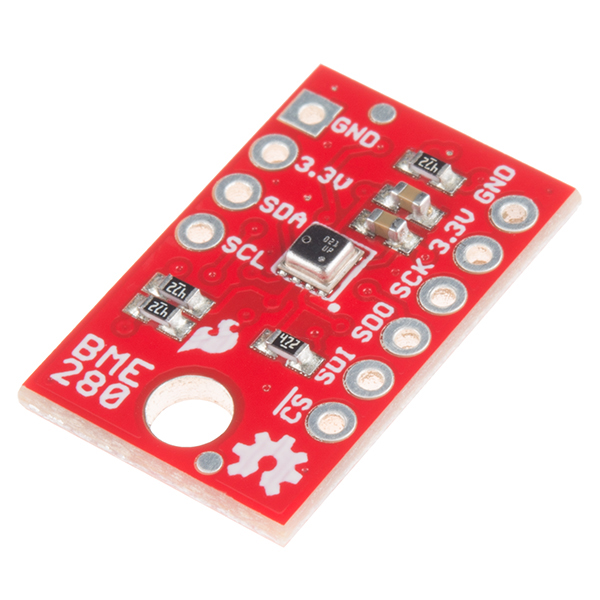
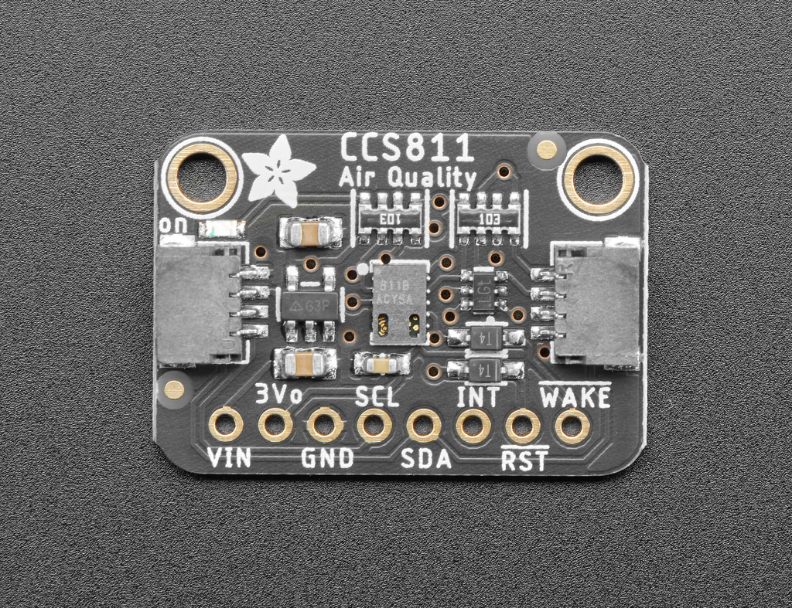
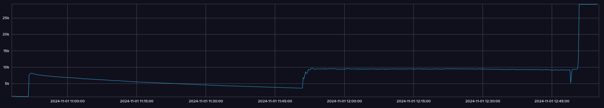
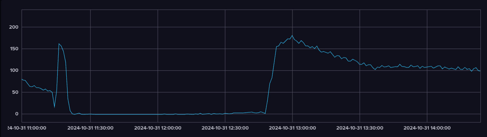
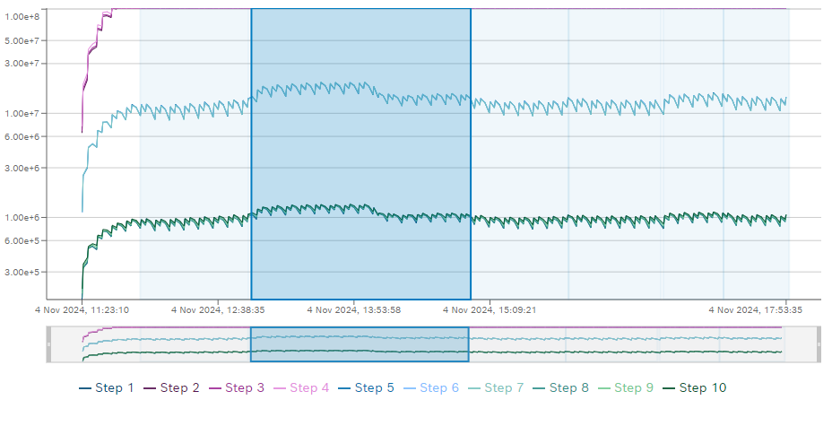
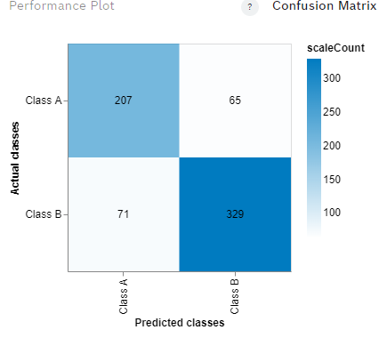
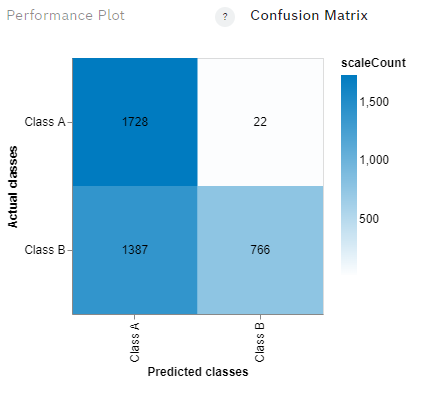

# PetWellTech 

PetWellTech develops hardware and software for monitoring pet health and associated activities.

The goal of the pilot project is to investigate possibilities of monitoring VOCs in dog breath with hardware available on the market and build a prototype solution 
that can detect for example acetone in dog breath. 

# Sensors Investigated

| Image                                                                                                                 | Sensor Name                                | Description                                                                                                                                                                                                                                                               |
|-----------------------------------------------------------------------------------------------------------------------|--------------------------------------------|---------------------------------------------------------------------------------------------------------------------------------------------------------------------------------------------------------------------------------------------------------------------------|
|     | "Electronic nose", Bosch BME688 sensor     | A [development kit](https://www.sparkfun.com/products/19630) consisting of 8 individual BME688 sensors was used to collect data along with a [Thing Plus - ESP32 WROOM (Micro-B)](https://www.sparkfun.com/products/15663). Documentation for the BME688 sensor can be found [here](https://www.bosch-sensortec.com/software/bme/docs/overview/getting-started.html). |
|      | SparkFun Atmospheric Sensor Breakout - BME280 | [Getting started guide](https://learn.sparkfun.com/tutorials/sparkfun-bme280-breakout-hookup-guide)                                                                                                                                                                     |
|      | Adafruit CCS811 Air Quality Sensor         | [Documentation](https://learn.adafruit.com/adafruit-ccs811-air-quality-sensor/overview)                                                                                                                                                                                  |

Theses sensors works by detecting total volatile organic compounds (TVOC) in the air. TVOC stands for Total Volatile Organic Compounds, representing the collective concentration of multiple carbon-based chemicals that evaporate at room temperature.

## Collecting data from the BME688 sensor 

Controlled environment in a plastic box. 
Volume of the box is 0,013 cubic meters. The amount of acetone injected was 0.01 ml 

- **Density of acetone**: 0.791 g/ml.
- **Molecular weight of acetone**: 58.08 g/mol.
- **Temperature**: 35°C (converted to Kelvin: 308.15 K).
- **Gas constant**: 8.3145 J/(mol⋅K).

### Steps:

1. **Convert Liquid Volume to Mass**:
   - Mass of acetone = 0.01 ml x 0.791 g/ml = 0.00791 g

2. **Convert Mass to Moles**:
   - Moles of acetone = mass / molecular weight = 0.00791 g / 58.08 g/mol ≈ 0.000136 mol

3. **Use Ideal Gas Law to Find Volume of Gas at 35°C**:
   - Calculate volume using V = nRT / p, assuming standard pressure (101325 Pa). For example using [this calculator for ideal gas law](https://www.omnicalculator.com/physics/ideal-gas-law?calculatorResult=H4sIAAAAAAAAA71X2W7cNhT9FUNP48BVRFHUYqABWqcFjCLJg9u8BIZBj2hZDbWAy6BGMP%2BeS2qjPPIsbhC9jLjcc%2B5%2BNd88VhdlzW4UVcy7%2FOatKV9rDov8MxUlvedMfqQVk97lF69qYOVdmF8q7ioqpXd74a0faV0sXd80XFfMXmnqvFRlU0tDUdatVrMXC%2BwH5nVDuQZFuq2zd2cB8OVMsbWr0aTM7dZVx0fPIPr9AzijMQDWCialFswPXahh9%2Bzdry8jDZc6pYw6eKbOIUUGFTq%2F%2BZEr3O3tpR%2FcDQiKVS0TVBk7iAvjHBisX8IE%2B4i8hOjcBljAbbTajdi%2B6FwMzEpoBnqJsiiYKOtiuGySZTTPWwjmwZgdS1FQeQd5KBWtlbcT6AMBfS3JlAV7Qn66k9wM2ZsLr9V7J4EO58frqExW6dJtBm6a2WO4vGFCQvf4sxEV9CbbRKzrTL8aT6%2BHcyBZrdBbFNjn%2FM1KsAcmWL1mn42G5%2BeeC%2FpJq0mul3mz2pWZ5eYe5o74fAniRdoVsqRLnGMO7mEMEA7JKWZaJY3Qoprz%2BO9z8gmMizR9mv7UMAItA5mrPXOuV6sr327eLcw99p8S9D1V1Gav%2FC3fUODJvcsHyiVUQCk%2FNPclZ%2BOGlkx0tupaiaerJjf1cPOHsUMLo%2BWTXf%2FlbNw8VfcNh%2B2vAnY5TFpNC9aLstqzqNcmWCXl%2F9Slkj2dsfOhc4jZfs9aVucG8QNtuyrjzfrrkvWzAr01Tqg15demPG3ez85hbcrXS32MoigOY5QigsMosMGpQMaAdwWrHv8FAO%2F3svioq3tmDBrm0nNxG6bO7dZhE1CtOe9ahreYqEdTYuL1vad%2FfV7dRyOR1A%2FSEWxczSv3aDQ0IqFhgpyIkPjZBNIttkMYD4R77lDHhotnRXE7dOlPNX9yh8IwB35yqvResgSBb6s%2FAcNPQnbktv8nHwCHpCjCQRQnCY5CjBBJUIhxlKIsIjEiGU7iGKMkDOMsIQgnJIarBCEMIlEaT%2BH7QViLpXSMOxCOgwgnaQjcGUmyNAaf45iQFEcJkEchCrIsRkma4RA0gidLcBKQIAhxlmauIT8GzS2rrkzsJDst1L3MdreDDA3hJDjcQU3jzM1DHEWvykMjt7VfQIKtm5KPf9GoVo2kG9ZV27rhnLaS5dd5X3%2BPjLd%2Fw3Ry2%2FxSY5eM2286OzZuuC5shrj%2BbUVZUWGmkhHKqcjvqKoa2T7CUJ0P8OlqxRca83R85XY1R6rY7cHTaQEH1hnfAUxqtSawDgAA). 
   - Volume ≈ 3.44 ml  

4. **Convert to ppm**:
   - Concentration (ppm) = (Volume of gas / Volume of box) x 1,000,000
   - Concentration ≈ (3.44 ml / 13000 ml) x 1,000,000 ≈ 265 ppm

The acetone was added to the enclosed box using a small syringe at the beginning of the test. There was no more acetone added during the test.

### The plastic test box

### Syringe & chemically clean acetone source

 

### Test 1

The table below shows the data collected for the different acetone concentrations and for clean air, as well as the duration of the data collection.

|               | \*Temperature (°C) | \*Humidity (%) | \*Pressure (hPa) | \*Gas Resistance (Ω) | Duration (mins) |
| ------------- | ------------------ | -------------- | ---------------- | --------------------- | ---------------- |
| Air training  |     3.501277e+01   | 1.925969e+01   | 1.020081e+03     | 3.489649e+07          | 45      |
|  Air test     |     3.459404e+01   | 1.943559e+01   | 1.018670e+03     | 3.361244e+07          | 45      |
|Acetone training| 3.635105e+01       | 2.050594e+01   | 1.021596e+03     | 1.580791e+07          | 15       |
| Acetone test  | 3.543839e+01       | 1.962744e+01   |  1.018924e+03    | 1.418220e+07          | 15 |

#### Formatted data (observe gas resistance in Mega ohms)

|                 | Temperature (°C) | Humidity (%) | Pressure (hPa) | Gas Resistance (MΩ) | Duration (mins) |
| --------------- | ---------------- | ------------ | -------------- | ------------------- | ---------------- |
| Air training    |        35.01     |      19.26   |     1020.08    |         34.90       |       45        |
| Air test        |        34.59     |      19.44   |     1018.67    |         33.61       |       45        |
| Acetone training|        36.35     |      20.51   |     1021.60    |         15.81       |       15        |
| Acetone test    |        35.44     |      19.63   |     1018.92    |         14.18       |       15        |

The image below shows the resistance change over time when the sensor was exposed to acetone and air. The highlighted area shows the resistance change when the sensor was exposed to acetone for the first cycle. WWhen the sensor was exposed to air the resistance decreased notably. The average resistance here was X

Compared to the reference air, the resistance change for acetone was significant. This is a good indication that the sensor can be trained to detect it at least at relatively high concentration.

#### AI training

Using the BME studio software an algorithm was trained to detect acetone. The training data set was used to train the data with a 70/30 split.
The image below shows the confusion matrix for the training data set.

The table below shows the accuracy of the training data set.

| Accuracy | F1 score | False positive |
| -------- | -------- | -------------- |
| 96.01%   | 96.11%   | 4.01%          |

#### AI testing

USing the BME studio software the trained algorithm was tested with the test data set. The image below shows the confusion matrix for the test data set.

This show that the algorithm was able to detect acetone with a high accuracy.

| Accuracy | F1 score | False positive |
| -------- | -------- | -------------- |
| 91.54%   | 91.53%   | 8.55%          |

## Test 2

### Larger Test Box

To achieve lower concentrations of acetone, a larger box constructed from acrylic plastic was used. The dimensions of the box were 0.6 x 0.6 x 0.6 meters, resulting in a volume of 0.216 cubic meters. A small fan was used to circulate the air inside the box.

Using calculations similar to those before, with a box volume of 0.216 cubic meters and 0.002 ml of acetone, the concentration of acetone in the box was approximately 30 ppm. Two tests were conducted with this same concentration of acetone.

The table below shows the data collected for different acetone concentrations and for clean air, as well as the duration of the data collection:

The image below illustrates the resistance change over time when the sensor was exposed to acetone and air.

##### Resistance Graph from the First Run of Test 2

#### AI Training

Using the BME Studio software, an algorithm was trained to detect acetone. The training dataset was split into a 70/30 ratio for training and validation. 

The image below shows the confusion matrix for the training dataset.

The table below shows the accuracy and F1 score for the training dataset.

| Metric          | Score |
| --------------- | ----- |
| Accuracy        | 83.79%|
| F1 Score        | 84.31%|
| False Positive  | 16.18%|

#### AI Testing

Using BME Studio software, the trained algorithm was tested with the test dataset. The image below shows the confusion matrix for the test dataset.

This shows that the algorithm was able to detect acetone with high accuracy.

| Metric          | Score |
| --------------- | ----- |
| Accuracy        | 77.21%|
| F1 Score        | 76.17%|
| False Positive  | 22.20%|

### Adafruit CCS811 and SparkFun BME280 Sensors

For the tests, both the Adafruit CCS811 and SparkFun BME280 sensors were placed inside the same box as the BME688 sensor. The data were then sent to an Influx database. The reason for using these sensors was to determine if they were capable of detecting acetone. Both sensors appeared to detect acetone as their resistances changed when acetone was added.

However, inconsistent changes in resistance were observed at the same acetone concentration. It was also noted that with the SparkFun sensor, there was a more substantial change in resistance when simply sitting close to the sensor compared to when it was in the box exposed to acetone. The image below shows the resistance change over time.

These graf show the resistance change over time for the BME280 and CCS811 sensors.

First in the box with air and then with acetone in the box. The first increase in tresistance is when the acetone is added to the box. The second increase is when the box is opened and the sensor is exposed to the air. As show in the graf the resistance change is quite simmilear for the air and acetone. This makes it hard to detect specificly acetone with these sensors. This was at a relative high concentration of 30 ppm.

**CCS811 sensor**

**BME280 sensor**

#### Result Test 2

The Bosch sensor successfully detected acetone in the box, the resistance changed slightly upon exposure to acetone. The trained AI algorithm also detected acetone but with notably lower accuracy than in previous tests.

The Adafruit CCS811 and SparkFun BME280 sensors were also able to detect acetone in the box, but they demonstrated inconsistent resistance changes and reactions to different room air conditions.

## Test 3

For the third test, the same setup as in Test 2 was used. The acetone was diluted with water to achieve a lower concentration of acetone in the box. The concentration for this test was 5 ppm.

The table below shows the data collected for this test.

#### AI Training

An algorithm was trained using the BME Studio software, applying the same method as before.

The image below displays the confusion matrix for the training dataset.

The table below shows the accuracy and F1 score for the training dataset.

| Metric          | Score |
| --------------- | ----- |
| Accuracy        | 83.79%|
| F1 Score        | 84.31%|
| False Positive  | 16.18%|

#### AI Testing

The trained algorithm was tested with the test dataset using the BME Studio software. The image below shows the confusion matrix for the test dataset.

| Metric          | Score |
| --------------- | ----- |
| Accuracy        | 63.90%|
| F1 Score        | 71.46%|
| False Positive  | 23.66%|

The testing result was highly dependent on the air and acetone data. Using air and acetone data from different days yielded varying results. In the image above the air sampel was taken the same day as the test and the result was 63.90%. We also tried using one air sample from the day before and two days before. The result varied from 59% to 83%. This indicates that the sensor is more sensitive to the air quality than the acetone concentration. This makes it difficult to detect acetone in a room with varying air quality.

### Conclusion: Tests 1 - 3

**Test 1:**

- The Bosch BME688 sensor worked well in a small box, clearly picking up changes when acetone was introduced. This suggests that the sensor can effectively detect acetone in controlled settings. The Artificial Intelligence (AI) model trained with this data performed well, identifying acetone with high accuracy in both training (96.01%) and testing (91.54%).

**Test 2:**

- When tested in a larger box with lower acetone levels (around 30 ppm), the BME688 sensor continued to detect acetone, but the AI's success rate dropped (Training: 83.79%, Testing: 77.21%). This could be because of the reduced concentration of acetone and differences in air quality.
- The Adafruit CCS811 and SparkFun BME280 sensors struggled to reliably detect acetone, showing inconsistent changes in resistance at the same concentration levels.

**Test 3:**

- At very low acetone concentrations (5 ppm), results varied greatly depending on changes in air quality. The AI model's accuracy ranged from 59% to 83%, showing that it struggled to maintain consistency in different conditions.

**Overall Conclusion:**
The Bosch BME688 sensor shows was decent at detecting acetone, especially at higher concentrations. However, its sensitivity to changes in overall air quality will affect its reliability in everyday settings. The Adafruit CCS811 and SparkFun BME280 sensors were less effective at distinguishing acetone from other elements in the air.

## Alternative sensor

Thes previsly tested sensor works by detecting total volatile organic compounds (TVOC) in the air. TVOC stands for Total Volatile Organic Compounds, representing the collective concentration of multiple carbon-based chemicals that evaporate at room temperature. Commonly found in household products like paints and cleaning supplies, TVOC sensors are useful for monitoring overall changes in air quality due to these compounds. However, they do not identify or measure specific gases. For detecting specific gases, such as aceton specialized sensors are necessary, as they provide precise measurement and identification of individual substances.

The [TGS1820](https://www.figarosensor.com/product/feature/tgs1820.html) is a hot wire semiconductor gas sensor developed by Figaro Engineering Inc. for the detection of acetone. It features high sensitivity and selectivity to acetone with minimal interference from ethanol and hydrogen and other gases, making it suitable for applications like breath acetone analysis.The sensor has typical detection range of 1 to 20 ppm acetone. Read more about the sensor [here](https://www.figarosensor.com/product/feature/tgs1820.html).

With this sensor it can be possible to detect acetone in the air with a higher accuracy than the previously tested sensors. Since it is specifically designed for acetone detection, it is expected to provide more reliable and consistent results.  

## Relevant publications

1. Z. Wang, C. Wang and P. Lathan, Breath Acetone Analysis of Diabetic Dogs Using a Cavity Ringdown Breath Analyzer, in IEEE Sensors Journal, [doi: 10.1109/JSEN.2013.2293705](https://ieeexplore.ieee.org/document/6678180).
2. Saasa V, Malwela T, Beukes M, Mokgotho M, Liu CP, Mwakikunga B. Sensing Technologies for Detection of Acetone in Human Breath for Diabetes Diagnosis and Monitoring. Diagnostics (Basel). 2018 Jan 31;8(1):12. [doi: 10.3390/diagnostics8010012](https://www.ncbi.nlm.nih.gov/pmc/articles/PMC5871995/).  
